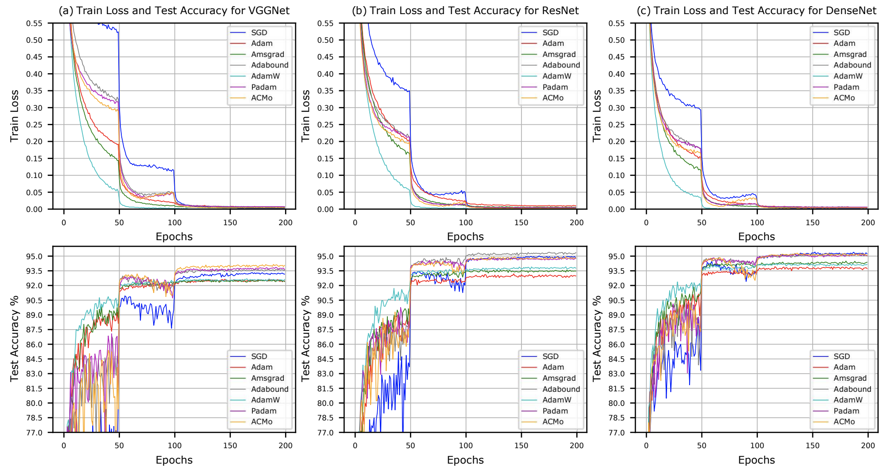

# ACMo: Angle-Calibrated Moment Methods for Stochastic Optimization

This project hosts the code for implementing the ACMo optimizer for training image classification and neural machine translation tasks.

> [**ACMo: Angle-Calibrated Moment Methods for Stochastic Optimization**](https://arxiv.org/abs/2011.09157),  
> Xunpeng Huang, Runxin Xu, Hao Zhou, Zhe Wang, Zhengyang Liu, Lei Li  
> In Proceedings of the 34th AAAI Conference on Artificial Intelligence (AAAI'21),
> *arXiv preprint ([arXiv 2006.07065](https://arxiv.org/abs/2006.07065))*   

## Highlights
- **Memory saving:** No second moments in ACMo helps to save GPU memories in large-scale data training.
- **Robust performance:** ACMo provide tier-1 convergence rate for both CV (the image classification) and NLP (the neural machine translation) tasks.
- **Simple hyper-parameters tuning:** Only one robust hyper-parameter exists in ACMo, which saves your time. 
- **Simple implementation:** The core part of ACMo can be implemented in 5 lines of code, thus being easy to use and modify.




## Usage

### Image Classification Training
    cd ./pytorch_cifar_task
    ./train.sh --optimizer=OPTIMIZER --lr=LEARNING_RATE --epoch=EPOCH_NUM --wd=WEIGHT_DECAY


## Acknowledgement
We would like to thank the [pytorch-cifar](https://github.com/kuangliu/pytorch-cifar) for its open-source project.

## Citations
Please consider citing our paper in your publications if the project helps your research. BibTeX reference is as follow.
```
@inproceedings{huang2021acmo,
  title= {ACMo: Angle-Calibrated Moment Methods for Stochastic Optimization},
  author= {Xunpeng Huang, Runxin Xu, Hao Zhou, Zhe Wang, Zhengyang Liu, Lei Li},
  booktitle = {Proceedings of the AAAI Conference on Artificial Intelligence},
  year= {2021}
}
```
